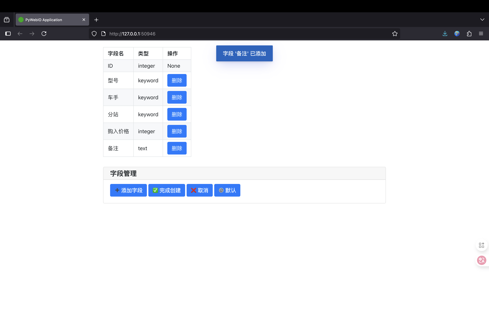
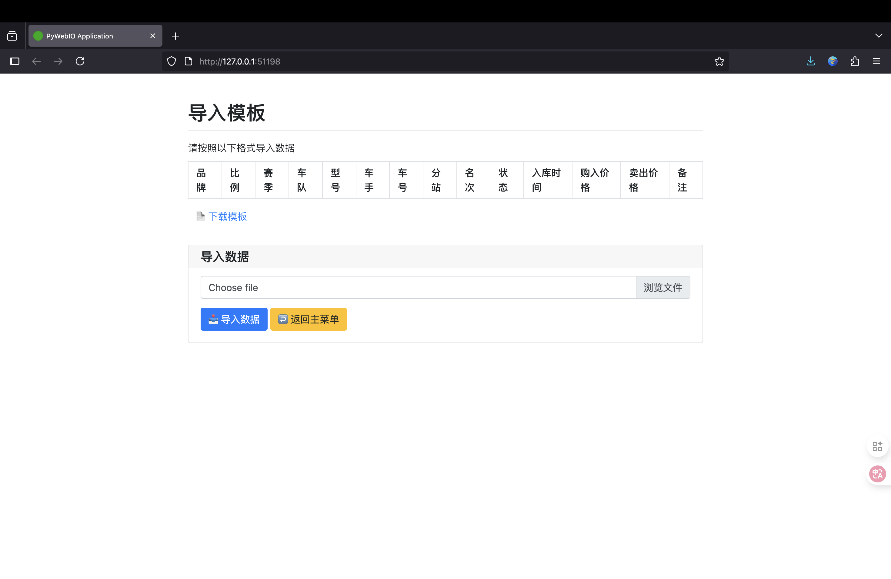
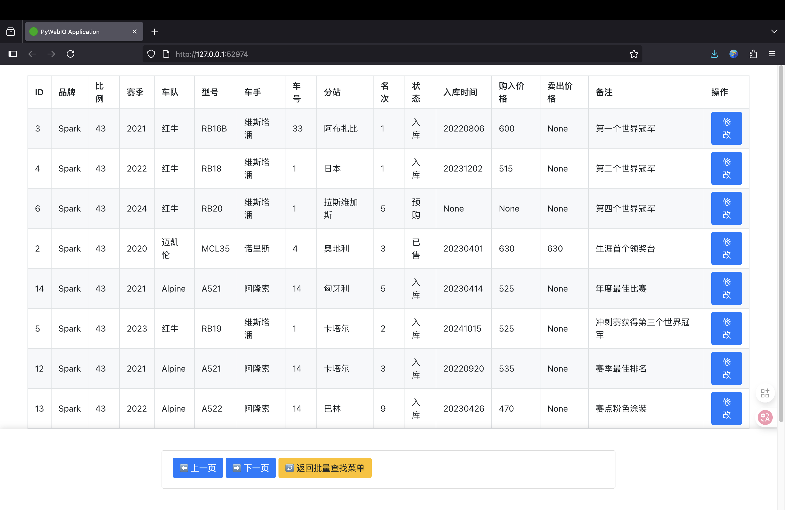

# 🏎️ AiModelAdministration

## 🔍 项目概述

**AiModelAdministration**是一款专为赛车模型爱好者打造的开源工具，结合 Elasticsearch 搜索引擎与 OpenAI 语义理解技术，提供高效、智能的模型收藏管理解决方案。系统支持多维度分类、智能检索和数据批量处理，让您的模型收藏管理更轻松。

## ✨ 核心功能
1. 全面的库存管理
- 支持模型信息的完整生命周期管理（新增、修改、查询、删除）
- 内置默认模型属性（品牌、比例、赛季、车队等）
- 支持自定义字段配置，适应不同收藏需求
2. 智能检索系统
- 关键词精确检索：按特定属性精准查找
- 模糊检索：支持近似匹配，容忍输入误差
- 语义检索：基于 OpenAI 向量嵌入，理解自然语言查询意图
3. 批量数据处理
- Excel 模板导入：快速批量添加模型数据
- 数据导出备份：支持将库存信息导出为 Excel
- 批量状态筛选：按入库 / 预售 / 退订 / 已售状态分类查看
4. 灵活的系统配置
- 支持 Elasticsearch 连接参数自定义
- 兼容 OpenAI 及兼容 API 服务（支持接口地址与密钥配置）
- 数据存储路径可配置，方便备份管理
5. 两种使用模式
- 默认模式：使用预设的赛车模型属性字段
- 自定义模式：根据个人需求创建专属字段体系

## 🛠️ 技术栈
- 后端
  - Python 3.8+
  - Elasticsearch Python SDK
  - OpenAI Python SDK
- 交互界面
  - PyWebIO（用于创建 Web 交互应用）

## 🚀 功能说明
1. 可视化的初始化数据库，可以自由构建你个数据库格式，也可使用默认格式  


2. 使用Excel表格批量录入数据，过去的数据一键录入，无痛转换平台  


3. 一键登记全新模型，方便快捷  


4. 多种检索模式

- 关键词检索——高效（传统匹配方式，搜索精准）  


- 模糊检索——方便（模糊匹配，支持拼写错误纠正）  


- 语义检索-智能（如搜索世冠即可返回世界冠军的模型）  


5. 一键修改，查找到模型，一键点击即可修改  


6. 已加导出成excel，方便备份数据  

## 📬 联系我们

- 📂 **GitHub项目仓库**: [AlexisZ12/AiModelAdministration](https://github.com/AlexisZ12/AiModelAdministration)
- 📂 **爱发电项目仓库**: [AiModelAdministration](https://afdian.com/album/9ed97c4077f211f087955254001e7c00)
- ⭐ **欢迎Star**: 如果喜欢这个项目，请在GitHub上点个Star支持我们
- ✉️ **联系邮箱**: 2242809239@qq.com
- 💬 **微信**: `Alexis_12_Z`
- 💖 **爱发电**: [AlexisZ12](https://afdian.com/a/AlexisZ12)


## 📦 项目环境部署指南

### 版本兼容性说明（仅供参考）

| 组件 | 测试版本 | 兼容范围 |
|------|----------|----------|
| Elasticsearch | 8.15.0 | 8.x系列 |
| Python | 3.10 | ≥3.10 |
| IK分词器 | 8.15.0 | 需与ES主版本严格匹配 |

> 注意事项  
> 1. IK分词器版本必须与Elasticsearch主版本一致  
> 2. 生产环境建议启用xpack安全模块  
> 3. Windows系统需使用PowerShell执行Docker命令

### 一、Elasticsearch环境部署

#### ▎方案一：官方渠道下载（推荐）

| 组件 | 下载地址 |
|------|----------|
| Elasticsearch | https://www.elastic.co/downloads/past-releases/elasticsearch-8-15-0 |
| IK分词器 | https://release.infinilabs.com/analysis-ik/stable/elasticsearch-analysis-ik-8.15.0.zip |
| Kibana（可选）| https://www.elastic.co/downloads/past-releases/kibana-8-15-0 |

#### ▎方案二：网络云盘下载

| 资源平台 | 下载地址 |
|----------|----------|
| 阿里云盘 | https://www.alipan.com/s/DSAeUFYeC11 |
| 夸克网盘 | https://pan.quark.cn/s/260c70bb004a |

#### ▎方案三：Docker容器化部署

**Elasticsearch独立部署**：

```bash
docker run -d --name elasticsearch \
  -p 127.0.0.1:9200:9200 \
  -p 127.0.0.1:9300:9300 \
  -e "discovery.type=single-node" \
  -e "ES_JAVA_OPTS=-Xms2g -Xmx2g" \
  -e "xpack.security.enabled=false" \
  -e "network.host=127.0.0.1" \
  -v ${LOCAL_DATA_PATH}/data:/usr/share/elasticsearch/data \
  -v ${LOCAL_DATA_PATH}/plugins:/usr/share/elasticsearch/plugins \
  -v ${LOCAL_DATA_PATH}/logs:/usr/share/elasticsearch/logs \
  docker.elastic.co/elasticsearch/elasticsearch:8.15.0
```

**Elasticsearch + Kibana联合部署**：

创建专用网络

```bash
docker network create es-net
```

启动Elasticsearch

```bash
docker run -d --name elasticsearch \
  --network es-net \
  -p 9200:9200 -p 9300:9300 \
  -e "discovery.type=single-node" \
  -e "ES_JAVA_OPTS=-Xms2g -Xmx2g" \
  -e "xpack.security.enabled=false" \
  -v ${LOCAL_DATA_PATH}/data:/usr/share/elasticsearch/data \
  -v ${LOCAL_DATA_PATH}/plugins:/usr/share/elasticsearch/plugins \
  -v ${LOCAL_DATA_PATH}/logs:/usr/share/elasticsearch/logs \
  docker.elastic.co/elasticsearch/elasticsearch:8.15.0
```

启动Kibana

```bash
docker run -d --name kibana \
  --network es-net \
  -p 5601:5601 \
  -e "ELASTICSEARCH_HOSTS=http://elasticsearch:9200" \
  docker.elastic.co/kibana/kibana:8.15.0
```

> **注意**：将`${LOCAL_DATA_PATH}`替换为实际存储路径，Kibana默认访问地址：http://localhost:5601

---

### 二、Python环境配置

#### ▎方案一：Conda虚拟环境部署（推荐）

创建Python 3.10虚拟环境

```bash
conda create -n es python=3.10 -y
conda activate es
```

安装核心依赖

```bash
pip install elasticsearch==8.15.0 openai pandas openpyxl
```
国内使用可尝试使用清华源加速

```bash
pip install elasticsearch==8.15.0 openai pandas openpyxl -i https://pypi.tuna.tsinghua.edu.cn/simple
```

#### ▎方案二：全局Python环境安装

确保Python版本≥3.10
```bash
python --version
```
安装项目依赖
```bash
pip install elasticsearch==8.15.0 openai pandas openpyxl
```
国内使用可尝试使用清华源加速
```bash
pip install elasticsearch==8.15.0 openai pandas openpyxl -i https://pypi.tuna.tsinghua.edu.cn/simple
```

### 三、ElasticSearch设置

初次使用需要安装IK分词器插件，并做部分设置，下面以MacOS为例进行初始化。  
1. 解压elasticsearch和IK分词器插件  

2. 把IK分词器解压文件名称改为ik  

3. 将IK分词器插件复制到`elasticsearch-8.15.0/plugins`文件夹中  

4. 启动ElasticSearch，运行文件`elasticsearch-8.15.0/bin/elasticsearch`  

5. 第一次运行可能会保存无法验证，先点`完成`  

6. 进入`设置`——`隐私与安全性`——`安全性`  

7. 点击`仍要打开`——`仍要打开`  

8. ElasticSearch会在终端中启动，起一次启动后直接关闭  
9. 打开配置文件`elasticsearch-8.15.0/config/elasticsearch.yml`按照一下模板修改  

```yml
# Enable security features
xpack.security.enabled: false

xpack.security.enrollment.enabled: false

# Enable encryption for HTTP API client connections, such as Kibana, Logstash, and Agents
xpack.security.http.ssl:
  enabled: false
  keystore.path: certs/http.p12

# Enable encryption and mutual authentication between cluster nodes
xpack.security.transport.ssl:
  enabled: false
  verification_mode: certificate
  keystore.path: certs/transport.p12
  truststore.path: certs/transport.p12
```

```yml
# Allow HTTP API connections from anywhere
# Connections are encrypted and require user authentication
http.host: 127.0.0.1
```

10. 重新启动ElasticSearch，运行文件`elasticsearch-8.15.0/bin/elasticsearch`  

