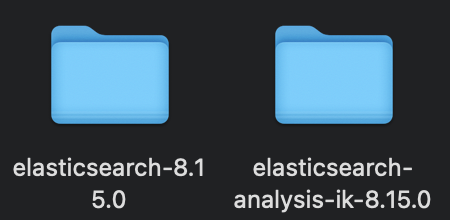
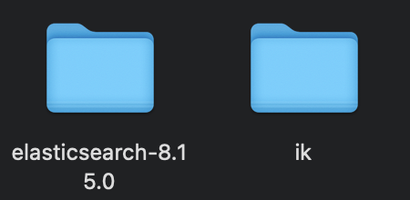
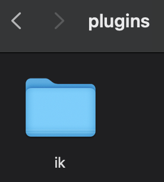
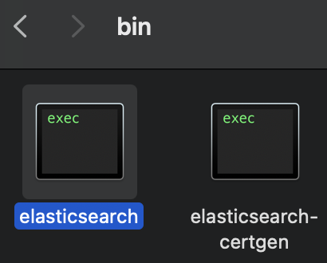
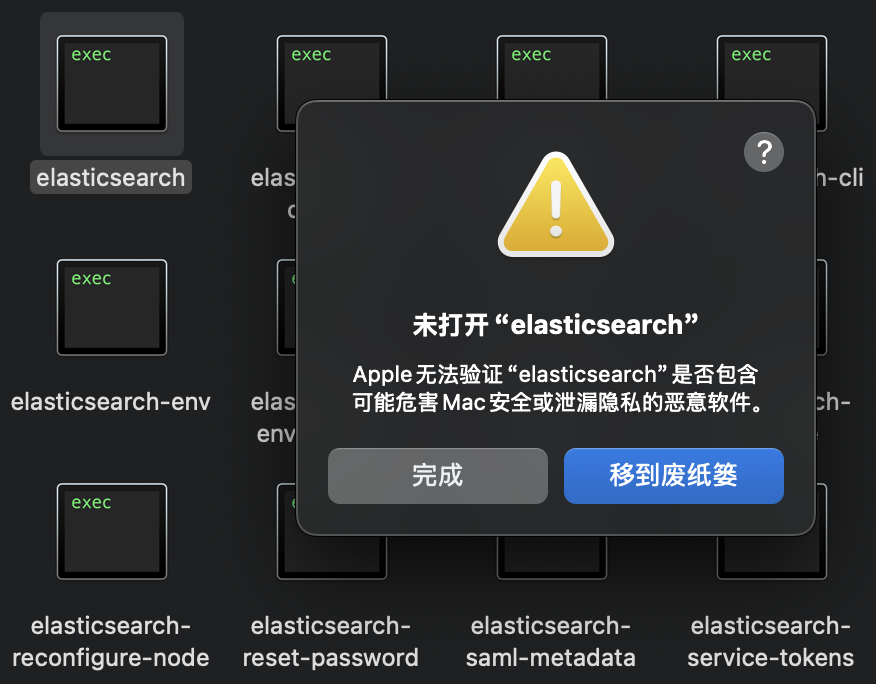
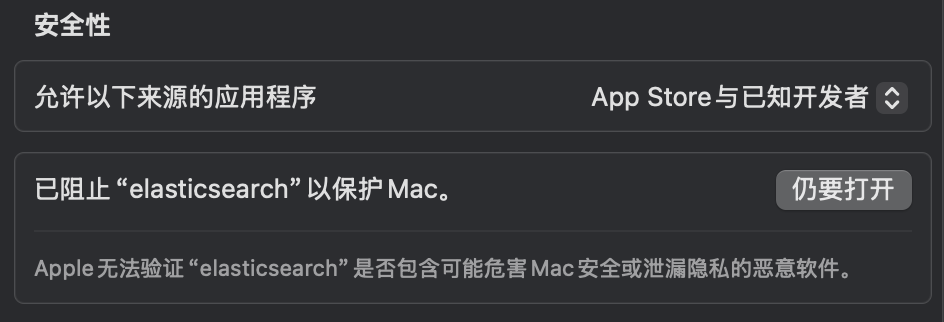
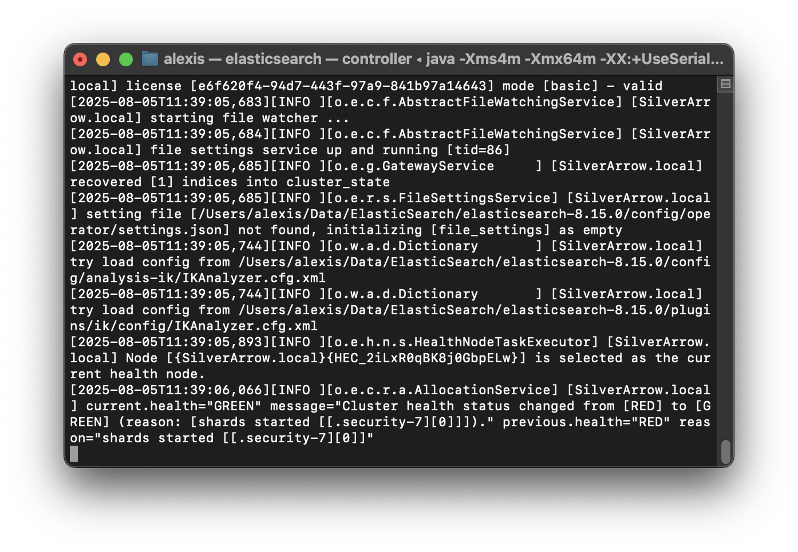

# 🏎 欢迎使用赛车模型库存管理系统
**赛车模型管理系统** 是一个专为赛车模型爱好者设计的开源免费的库存管理工具，帮助你高效管理和追踪心爱的模型收藏品。
我们非常重视用户的反馈，如果你有任何建议或发现问题，请通过以下方式联系我：
- 📂 **项目仓库**: [github.com/AlexisZ12/AiModelAdministration](https://github.com/AlexisZ12/AiModelAdministration)
- ⭐ **欢迎Star**: 如果喜欢这个项目，请在GitHub上点个Star支持我们
- 📬 **联系邮箱**: 2242809239@qq.com
🚀 **当前版本**: v1.0.0 | 🔄 **最后更新**: 2025-08-04
---
### 🌈 特色功能
- 完整的模型收藏管理
- 支持多维度分类系统
- 数据导入/导出功能
- 可视化统计报表（待更新）

# 项目环境部署指南

## 系统依赖要求
本项目运行依赖以下核心组件：
- **Elasticsearch**：分布式搜索与分析引擎
- **IK分词器插件**：支持中文分词处理
- **Python**：主程序运行环境
- **Kibana(可选)**：Elasticsearch可视化控制台

## 版本兼容性说明（仅供参考）
| 组件 | 测试版本 | 兼容范围 |
|------|----------|----------|
| Elasticsearch | 8.15.0 | 8.x系列 |
| Python | 3.10 | ≥3.10 |
| IK分词器 | 8.15.0 | 需与ES主版本严格匹配 |

> 注意事项  
> 1. IK分词器版本必须与Elasticsearch主版本一致  
> 2. 生产环境建议启用xpack安全模块  
> 3. Windows系统需使用PowerShell执行Docker命令

## 一、Elasticsearch环境部署
### ▎方案一：官方渠道下载（推荐）
| 组件 | 下载地址 |
|------|----------|
| Elasticsearch | https://www.elastic.co/downloads/past-releases/elasticsearch-8-15-0 |
| IK分词器 | https://release.infinilabs.com/analysis-ik/stable/elasticsearch-analysis-ik-8.15.0.zip |
| Kibana（可选）| https://www.elastic.co/downloads/past-releases/kibana-8-15-0 |

### ▎方案二：网络云盘下载
| 资源平台 | 下载地址 |
|----------|----------|
| 阿里云盘 | https://www.alipan.com/s/DSAeUFYeC11 |
| 夸克网盘 | https://pan.quark.cn/s/260c70bb004a |

### ▎方案三：Docker容器化部署
**Elasticsearch独立部署**：
```bash
docker run -d --name elasticsearch \
  -p 127.0.0.1:9200:9200 \
  -p 127.0.0.1:9300:9300 \
  -e "discovery.type=single-node" \
  -e "ES_JAVA_OPTS=-Xms2g -Xmx2g" \
  -e "xpack.security.enabled=false" \
  -e "network.host=127.0.0.1" \
  -v ${LOCAL_DATA_PATH}/data:/usr/share/elasticsearch/data \
  -v ${LOCAL_DATA_PATH}/plugins:/usr/share/elasticsearch/plugins \
  -v ${LOCAL_DATA_PATH}/logs:/usr/share/elasticsearch/logs \
  docker.elastic.co/elasticsearch/elasticsearch:8.15.0
```

**Elasticsearch + Kibana联合部署**：
创建专用网络
```bash
docker network create es-net
```
启动Elasticsearch
```bash
docker run -d --name elasticsearch \
  --network es-net \
  -p 9200:9200 -p 9300:9300 \
  -e "discovery.type=single-node" \
  -e "ES_JAVA_OPTS=-Xms2g -Xmx2g" \
  -e "xpack.security.enabled=false" \
  -v ${LOCAL_DATA_PATH}/data:/usr/share/elasticsearch/data \
  -v ${LOCAL_DATA_PATH}/plugins:/usr/share/elasticsearch/plugins \
  -v ${LOCAL_DATA_PATH}/logs:/usr/share/elasticsearch/logs \
  docker.elastic.co/elasticsearch/elasticsearch:8.15.0
```
启动Kibana
```bash
docker run -d --name kibana \
  --network es-net \
  -p 5601:5601 \
  -e "ELASTICSEARCH_HOSTS=http://elasticsearch:9200" \
  docker.elastic.co/kibana/kibana:8.15.0
```

> **注意**：将`${LOCAL_DATA_PATH}`替换为实际存储路径，Kibana默认访问地址：http://localhost:5601

---

## 二、Python环境配置
### ▎方案一：Conda虚拟环境部署（推荐）
创建Python 3.10虚拟环境
```bash
conda create -n es python=3.10 -y
conda activate es
```
安装核心依赖
```bash
pip install elasticsearch==8.15.0 openai pandas openpyxl
```
国内使用可尝试使用清华源加速
```bash
pip install elasticsearch==8.15.0 openai  pandas  openpyxl  -i https://pypi.tuna.tsinghua.edu.cn/simple
```

### ▎方案二：全局Python环境安装
确保Python版本≥3.10
```bash
python --version
```
安装项目依赖
```bash
pip install elasticsearch==8.15.0 openai pandas openpyxl
```
国内使用可尝试使用清华源加速
```bash
pip install elasticsearch==8.15.0 openai  pandas  openpyxl  -i https://pypi.tuna.tsinghua.edu.cn/simple
```

## 三、ElasticSearch设置
初次使用需要安装IK分词器插件，并做部分设置，下面以MacOS为例进行初始化。  
1. 解压elasticsearch和IK分词器插件  

2. 把IK分词器解压文件名称改为ik  

3. 将IK分词器插件复制到`elasticsearch-8.15.0/plugins`文件夹中  

4. 启动ElasticSearch，运行文件`elasticsearch-8.15.0/bin/elasticsearch`  

5. 第一次运行可能会保存无法验证，先点`完成`  

6. 进入`设置`——`隐私与安全性`——`安全性`  

7. 点击`仍要打开`——`仍要打开`  

8. ElasticSearch会在终端中启动，起一次启动后直接关闭  
9. 打开配置文件`elasticsearch-8.15.0/config/elasticsearch.yml`按照一下模板修改  
```yml
# Enable security features
xpack.security.enabled: false

xpack.security.enrollment.enabled: false

# Enable encryption for HTTP API client connections, such as Kibana, Logstash, and Agents
xpack.security.http.ssl:
  enabled: false
  keystore.path: certs/http.p12

# Enable encryption and mutual authentication between cluster nodes
xpack.security.transport.ssl:
  enabled: false
  verification_mode: certificate
  keystore.path: certs/transport.p12
  truststore.path: certs/transport.p12
```
```yml
# Allow HTTP API connections from anywhere
# Connections are encrypted and require user authentication
http.host: 127.0.0.1
```
10. 重新启动ElasticSearch，运行文件`elasticsearch-8.15.0/bin/elasticsearch`  

