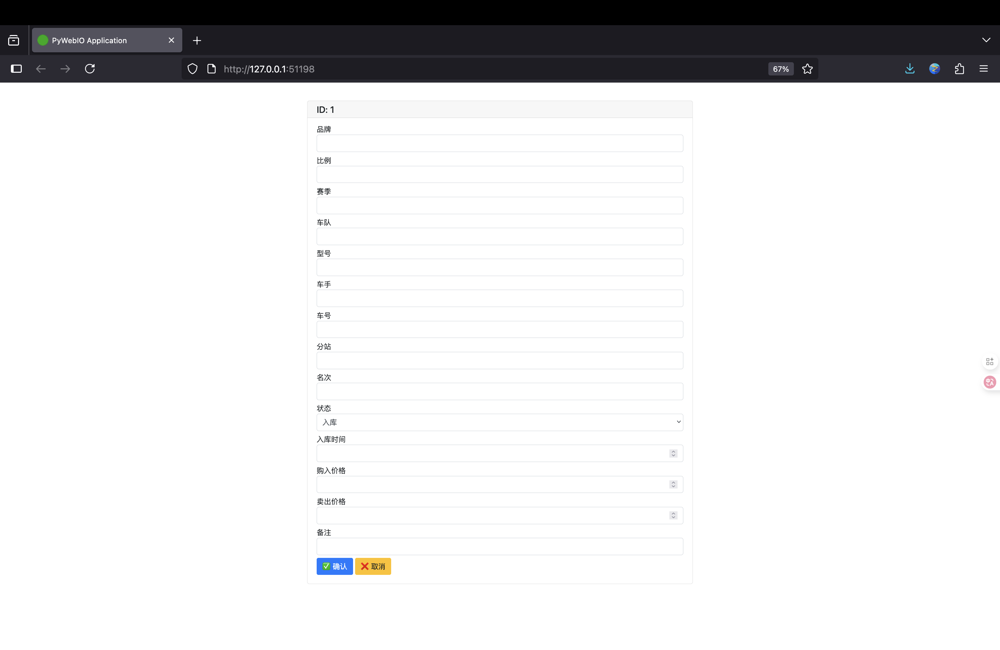

# 🏎 欢迎使用赛车模型库存管理系统
**赛车模型管理系统** 是一个专为赛车模型爱好者设计的开源免费的库存管理工具，帮助你高效管理和追踪心爱的模型收藏品。
我们非常重视用户的反馈，如果你有任何建议或发现问题，请通过以下方式联系我：
- 📂 **项目仓库**: [github.com/AlexisZ12/AiModelAdministration](https://github.com/AlexisZ12/AiModelAdministration)
- ⭐ **欢迎Star**: 如果喜欢这个项目，请在GitHub上点个Star支持我们
- 📬 **联系邮箱**: 2242809239@qq.com
🚀 **当前版本**: v1.0.0 | 🔄 **最后更新**: 2025-08-04
---
### 🌈 特色功能
- 完整的模型收藏管理
- 支持多维度分类系统
- 数据导入/导出功能
- 可视化统计报表（待更新）

# 项目说明
还在使用Excel表格管理你的库存吗？

苦于不会使用数据库吗？

​告别繁琐搜索，一句话找到你的库存！​​

智能语义驱动的新一代库存管理解决方案​

- 核心引擎：​​**​ElasticSearch​**​ - 业界领先的分布式搜索与分析引擎，确保海量库存数据的高速检索与分析能力。
- ​人工智能赋能：​​​**​OpenAI Embedding模型​**​ - 我们将您的文字描述（如产品名称、规格、备注等）转化为AI能理解的“数字指纹”，实现了真正的语义级搜索。不再需要精确匹配关键词。
- ​轻量易用前端：​**​​​Pywebio​**​ - 提供清新简洁的网页操作界面，无需本地安装，浏览器访问即可轻松管理库存，降低使用门槛。

# 功能说明
1. 可视化的初始化数据库，可以自由构建你个数据库格式，也可使用默认格式  


2. 使用Excel表格批量录入数据，过去的数据一键录入，无痛转换平台  


3. 一键登记全新模型，方便快捷  


4. 多种检索模式

- 关键词检索——高效（传统匹配方式，搜索精准）  


- 模糊检索——方便（模糊匹配，支持拼写错误纠正）  


- 语义检索-智能（如搜索世冠即可返回世界冠军的模型）  


5. 一键修改，查找到模型，一键点击即可修改


6. 已加导出成excel，方便备份数据  

# 项目环境部署指南
## 版本兼容性说明（仅供参考）
| 组件 | 测试版本 | 兼容范围 |
|------|----------|----------|
| Elasticsearch | 8.15.0 | 8.x系列 |
| Python | 3.10 | ≥3.10 |
| IK分词器 | 8.15.0 | 需与ES主版本严格匹配 |

> 注意事项  
> 1. IK分词器版本必须与Elasticsearch主版本一致  
> 2. 生产环境建议启用xpack安全模块  
> 3. Windows系统需使用PowerShell执行Docker命令

## 一、Elasticsearch环境部署
### ▎方案一：官方渠道下载（推荐）
| 组件 | 下载地址 |
|------|----------|
| Elasticsearch | https://www.elastic.co/downloads/past-releases/elasticsearch-8-15-0 |
| IK分词器 | https://release.infinilabs.com/analysis-ik/stable/elasticsearch-analysis-ik-8.15.0.zip |
| Kibana（可选）| https://www.elastic.co/downloads/past-releases/kibana-8-15-0 |

### ▎方案二：网络云盘下载
| 资源平台 | 下载地址 |
|----------|----------|
| 阿里云盘 | https://www.alipan.com/s/DSAeUFYeC11 |
| 夸克网盘 | https://pan.quark.cn/s/260c70bb004a |

### ▎方案三：Docker容器化部署
**Elasticsearch独立部署**：

```bash
docker run -d --name elasticsearch \
  -p 127.0.0.1:9200:9200 \
  -p 127.0.0.1:9300:9300 \
  -e "discovery.type=single-node" \
  -e "ES_JAVA_OPTS=-Xms2g -Xmx2g" \
  -e "xpack.security.enabled=false" \
  -e "network.host=127.0.0.1" \
  -v ${LOCAL_DATA_PATH}/data:/usr/share/elasticsearch/data \
  -v ${LOCAL_DATA_PATH}/plugins:/usr/share/elasticsearch/plugins \
  -v ${LOCAL_DATA_PATH}/logs:/usr/share/elasticsearch/logs \
  docker.elastic.co/elasticsearch/elasticsearch:8.15.0
```

**Elasticsearch + Kibana联合部署**：
创建专用网络

```bash
docker network create es-net
```

启动Elasticsearch

```bash
docker run -d --name elasticsearch \
  --network es-net \
  -p 9200:9200 -p 9300:9300 \
  -e "discovery.type=single-node" \
  -e "ES_JAVA_OPTS=-Xms2g -Xmx2g" \
  -e "xpack.security.enabled=false" \
  -v ${LOCAL_DATA_PATH}/data:/usr/share/elasticsearch/data \
  -v ${LOCAL_DATA_PATH}/plugins:/usr/share/elasticsearch/plugins \
  -v ${LOCAL_DATA_PATH}/logs:/usr/share/elasticsearch/logs \
  docker.elastic.co/elasticsearch/elasticsearch:8.15.0
```

启动Kibana

```bash
docker run -d --name kibana \
  --network es-net \
  -p 5601:5601 \
  -e "ELASTICSEARCH_HOSTS=http://elasticsearch:9200" \
  docker.elastic.co/kibana/kibana:8.15.0
```

> **注意**：将`${LOCAL_DATA_PATH}`替换为实际存储路径，Kibana默认访问地址：http://localhost:5601

---

## 二、Python环境配置
### ▎方案一：Conda虚拟环境部署（推荐）
创建Python 3.10虚拟环境

```bash
conda create -n es python=3.10 -y
conda activate es
```

安装核心依赖

```bash
pip install elasticsearch==8.15.0 openai pandas openpyxl
```
国内使用可尝试使用清华源加速

```bash
pip install elasticsearch==8.15.0 openai  pandas  openpyxl  -i https://pypi.tuna.tsinghua.edu.cn/simple
```

### ▎方案二：全局Python环境安装
确保Python版本≥3.10
```bash
python --version
```
安装项目依赖
```bash
pip install elasticsearch==8.15.0 openai pandas openpyxl
```
国内使用可尝试使用清华源加速
```bash
pip install elasticsearch==8.15.0 openai  pandas  openpyxl  -i https://pypi.tuna.tsinghua.edu.cn/simple
```

## 三、ElasticSearch设置
初次使用需要安装IK分词器插件，并做部分设置，下面以MacOS为例进行初始化。  
1. 解压elasticsearch和IK分词器插件  

2. 把IK分词器解压文件名称改为ik  

3. 将IK分词器插件复制到`elasticsearch-8.15.0/plugins`文件夹中  

4. 启动ElasticSearch，运行文件`elasticsearch-8.15.0/bin/elasticsearch`  

5. 第一次运行可能会保存无法验证，先点`完成`  

6. 进入`设置`——`隐私与安全性`——`安全性`  

7. 点击`仍要打开`——`仍要打开`  

8. ElasticSearch会在终端中启动，起一次启动后直接关闭  
9. 打开配置文件`elasticsearch-8.15.0/config/elasticsearch.yml`按照一下模板修改  

```yml
# Enable security features
xpack.security.enabled: false

xpack.security.enrollment.enabled: false

# Enable encryption for HTTP API client connections, such as Kibana, Logstash, and Agents
xpack.security.http.ssl:
  enabled: false
  keystore.path: certs/http.p12

# Enable encryption and mutual authentication between cluster nodes
xpack.security.transport.ssl:
  enabled: false
  verification_mode: certificate
  keystore.path: certs/transport.p12
  truststore.path: certs/transport.p12
```

```yml
# Allow HTTP API connections from anywhere
# Connections are encrypted and require user authentication
http.host: 127.0.0.1
```

10. 重新启动ElasticSearch，运行文件`elasticsearch-8.15.0/bin/elasticsearch`  

